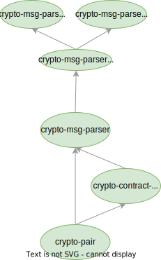

# crypto-msg-parser

The parser library to parse messages from [crypto-crawler](https://github.com/crypto-crawler/crypto-crawler-rs/tree/main/crypto-crawler).

## Architecture

- [crypto-msg-parser](./crypto-msg-parser) is the parser library to parse messages from `crypto-crawler`.
- [crypto-pair](./crypto-pair) is an offline utility library to parse exchange-specific symbols to unified format.
- [crypto-contract-value](./crypto-pair) is an offline utility library that simply provides the contract values of a trading market.
- Support multiple languages. Some libraries support multiple languages, which is achieved by first providing a FFI binding, then a languge specific wrapper. For example, `crypto-crawler` provides a C-style FFI binding first, and then provides a Python wrapper and a C++ wrapper based on the FFI binding.
- [crypto-message](./crypto-message) contains all output data types of `crypto-msg-parser`.
